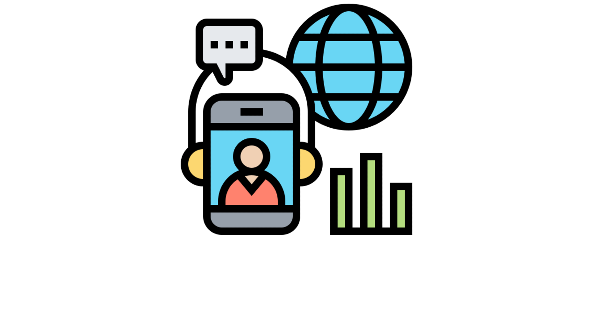

# EasyItMobileApp

<!--<h1 align="center">
    
</h1>-->

<h2 align="center">
    
    <!-- Imagem demonstrativa -->
</h2>

<br>

---

<h2>📋 Index</h2>

<br>

<ul>
    <li><a href="#about">About it</a></li>
    <li><a href="#techs">Tecnologias Utilizadas</a></li>    <!-- -->
    <li><a href="#layout">Layout</a></li>    <!-- -->
    <li><a href="#run">How to run</a></li>    <!-- -->
    <li><a href="#goals">Ideias</a></li>    <!-- -->
    <li><a href="#contribute">How to contribute</a></li>    <!-- -->
</ul>

<br>

---

<h2 id="about">📖 About it</h2>

<br>

<h3>Greetings and Salutations!</h3>

<p>
    &nbsp;&nbsp;&nbsp;&nbsp;<strong>EasyItMobileApp</strong> is an application designed to run on smartphones and tablets, and its purpose is to the community can have access to various types of services in the area of IT and Technology, during these times of pandemic, they have a hard time having to go to a local store physically, with this app, they 
    don't have to.
</p>

<br>

---

<h2 id="techs">🛠 Tecnologias e Ferramentas Utilizadas</h2>

<br>

<h3>Front End</h3>

<ul>
    <li>JavaScript;</li>
    <li>React Native;</li>
    <li>Visual Code Studio;</li>
</ul>

<h3>Back End</h3>

<ul>
    <li>C#t;</li>
    <li>ASP .NET Core Web API;</li>
    <li>Visual Studio;</li>
    <li>MySQL</li>
</ul>

<br>

---

<h2 id="layout">🔖 Layout</h2>

<!--&nbsp;&nbsp;&nbsp;&nbsp;You can view the inicial layout of the project at <a href="https://www.figma.com/file/m3yboywRJO2H04cvYQXevo/Move.it-1.0-(Copy)?node-id=160%3A2761" target="_blank">Move.it - layout</a>. You must have a <a href="https://www.figma.com/" target="_blank">Figma</a> account in order to access it. The final layout can be visualized <a href="https://www.figma.com/file/mt52N4YoKzAOYslPbjJFCt/Move.it-2.0-(Copy)?node-id=160%3A2761" target="_blank">here</a>.-->

<br>

---

<h2 id="run">⚙️ How to Run</h2>

&nbsp;&nbsp;&nbsp;&nbsp;To run the application locally, you must first install <a href="https://git-scm.com" target="_blank">Git</a>, <a href="https://nodejs.org/en/" target="_blank">Node.js</a> and <a href="https://code.visualstudio.com/" target="_blank">VSCode</a>.

<br>

<h3>🧭 Running the application</h3>

<br>

```bash
# Clone this repository
git clone https://github.com/RenatoLomba/EasyItMobileApp.git

# Find the directory
cd EasyItMobileApp

# Download dependencies
yarn

# Download Expo globally
yarn add expo

# Run the application
expo start

# Open it in your Browser or Smartphone using Expo
```

<br>

---

<h2 id="goals">💡 Ideas</h2>

<br>

- [ ] Add login with github account (<a href="https://docs.github.com/pt/developers/apps/authorizing-oauth-apps" target="_blank">Oauth Github</a>);
- [ ] Add dark theme;

<br>

---

<h2 id="contribute">💪 How to contribute</h2>

<br>

<ol>
    <li>Fork the project.</li>
    <li>Create a new branch with your changes: `git checkout -b my-feature`</li>
    <li>Save your changes and commit describing what you did: `git commit -m "feature: My new feature"`</li>
    <li>Submit your changes: `git push origin my-feature`</li>
</ol>

<br>

---

<br>

Code by <a href="https://github.com/RenatoLomba">RenatoLomba</a>
